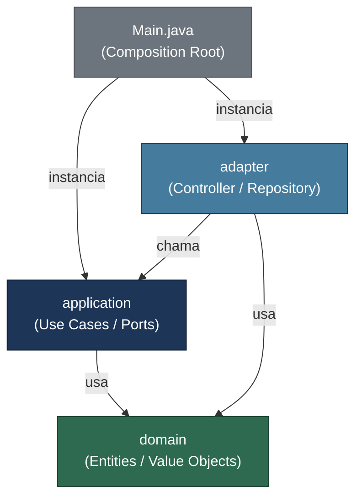
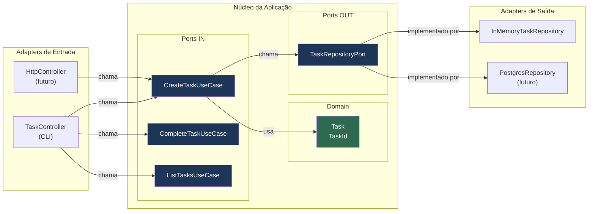
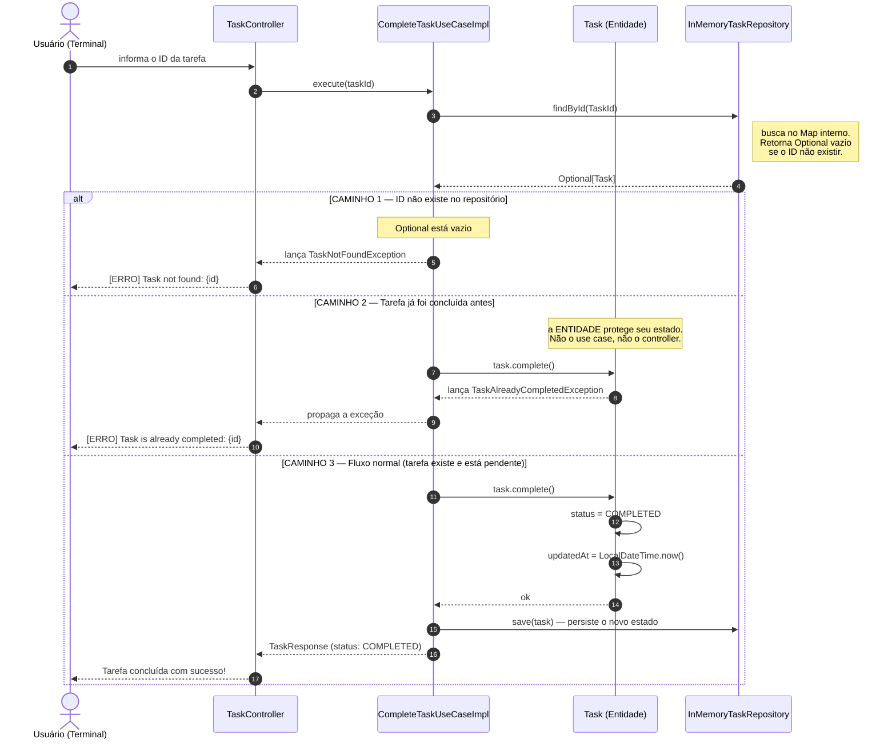
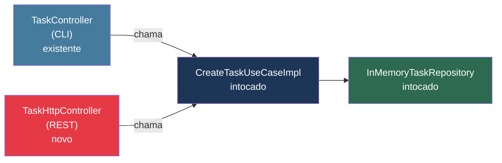

# Clean Architecture em Java Puro

> Projeto didático de gerenciamento de tarefas construído com **Java 21 puro**, sem frameworks,
> para demonstrar na prática os conceitos da **Arquitetura Limpa** de Robert C. Martin (Uncle Bob).

---

## Índice

1. [O problema que a Clean Architecture resolve](#1-o-problema-que-a-clean-architecture-resolve)
2. [A ideia central: a Regra da Dependência](#2-a-ideia-central-a-regra-da-dependência)
3. [A Regra na Prática — Código Real](#3-a-regra-na-prática--código-real)
4. [As 4 Camadas](#4-as-4-camadas)
5. [Por que Java Puro — Screaming Architecture](#5-por-que-java-puro--screaming-architecture)
6. [Fluxo de Controle vs Inversão de Dependência](#6-fluxo-de-controle-vs-inversão-de-dependência)
7. [Ports & Adapters — o coração do padrão](#7-ports--adapters--o-coração-do-padrão)
8. [O fluxo completo de uma operação](#8-o-fluxo-completo-de-uma-operação)
9. [Estrutura de arquivos comentada](#9-estrutura-de-arquivos-comentada)
10. [O papel de cada classe](#10-o-papel-de-cada-classe)
11. [Por que DTOs? Command e Response](#11-por-que-dtos-command-e-response)
12. [O poder da substituição](#12-o-poder-da-substituição)
13. [Como executar](#13-como-executar)
14. [Resumo visual rápido](#14-resumo-visual-rápido)
15. [Leituras recomendadas](#15-leituras-recomendadas)

---

## 1. O problema que a Clean Architecture resolve

Sem uma arquitetura definida, sistemas crescem assim:

```
┌──────────────────────────────────────────────────────────┐
│                      Código típico                        │
│                                                          │
│   Controller ──────► Service ──────► Repository          │
│       │                  │                │              │
│       │            lógica de         SQL direto          │
│       │            negócio +         no service          │
│       │            validação +                           │
│       │            formatação                            │
│       │            misturadas                            │
│       │                                                  │
│       └──────────────────────────────────────────────────│
│                tudo acoplado a tudo                       │
└──────────────────────────────────────────────────────────┘
```

**Os sintomas:**

- Trocar o banco de dados exige mexer no service (e às vezes no controller)
- Testar a lógica de negócio exige subir o banco inteiro
- Adicionar um novo canal (ex: REST + GraphQL) duplica código
- Quanto maior o sistema, mais difícil entender o que ele faz de negócio

**A Clean Architecture separa claramente:**

| O que o sistema **é** | O que o sistema **usa** |
|---|---|
| Regras de negócio (domínio) | Banco de dados |
| O que o sistema faz (casos de uso) | Framework web |
| — | CLI, fila de mensagens, etc. |

> O que o sistema **é** fica no centro. O que ele **usa** fica na borda e pode ser trocado.

---

## 2. A ideia central: a Regra da Dependência

```
         ╔═══════════════════════════════════════════╗
         ║                                           ║
         ║    ╔═══════════════════════════════╗      ║
         ║    ║                               ║      ║
         ║    ║    ╔═══════════════════╗      ║      ║
         ║    ║    ║                   ║      ║      ║
         ║    ║    ║    ╔═════════╗    ║      ║      ║
         ║    ║    ║    ║ DOMAIN  ║    ║      ║      ║
         ║    ║    ║    ╚═════════╝    ║      ║      ║
         ║    ║    ║   APPLICATION     ║      ║      ║
         ║    ║    ╚═══════════════════╝      ║      ║
         ║    ║        ADAPTERS               ║      ║
         ║    ╚═══════════════════════════════╝      ║
         ║          FRAMEWORKS & DRIVERS             ║
         ╚═══════════════════════════════════════════╝

              ◄─────────────────────────────
              as dependências só apontam para DENTRO
```

**A regra de ouro:**

- `domain` não importa nada de nenhuma outra camada
- `application` importa apenas `domain`
- `adapter` importa `application` e `domain`
- `Main.java` importa tudo (é o único ponto de montagem)



---

## 3. A Regra na Prática — Código Real

A teoria é clara, mas como ela aparece no código? Veja os `import` de cada camada.

### O domínio não importa nada externo

```java
// Task.java — camada domain
package com.example.domain.entity;

import com.example.domain.exception.TaskAlreadyCompletedException; // próprio domínio ✓
import com.example.domain.valueobject.TaskId;                      // próprio domínio ✓
import java.time.LocalDateTime;                                    // JDK padrão     ✓

// Nenhum import de: spring, jakarta, hibernate, jackson, jdbc...
```

### O caso de uso depende apenas de interfaces, nunca de implementações

```java
// CreateTaskUseCaseImpl.java — camada application
package com.example.application.usecase;

import com.example.application.port.out.TaskRepositoryPort; // interface ✓ (application define)
import com.example.domain.entity.Task;                      // domain    ✓
import com.example.application.dto.CreateTaskCommand;       // dto       ✓

// NÃO importa: InMemoryTaskRepository, JdbcTaskRepository, nenhuma implementação concreta
```

Esta é a **Inversão de Dependência (DIP)** em ação. O caso de uso chama `repository.save(task)` sem saber — nem se importar — se por baixo é um `Map<>` em memória ou uma chamada SQL a um PostgreSQL.

```
                    ┌──────────────────────────────────────────┐
  CreateTaskUseCase │                                          │
  UseCaseImpl       │  repository.save(task)                   │
       │            │                                          │
       │            │  A instrução é dada para a INTERFACE.    │
       │            │  Quem vai executar é resolvido           │
       │            │  apenas em tempo de execução             │
       ▼            │  (no Main.java).                         │
  TaskRepository    │                                          │
  Port <<interface>>│                                          │
       ▲            └──────────────────────────────────────────┘
       │
       │  implementa
       │
  InMemoryTask          ← hoje
  Repository
  (ou JdbcTask          ← amanhã, sem mudar o use case
  Repository)
```

### O adapter conhece a interface, mas o use case não conhece o adapter

```java
// InMemoryTaskRepository.java — camada adapter
package com.example.adapter.repository;

import com.example.application.port.out.TaskRepositoryPort; // depende da interface ✓
import com.example.domain.entity.Task;                      // depende do domain   ✓
import java.util.LinkedHashMap;                             // detalhe técnico aqui ✓

// O adapter sabe que existe a interface. A interface não sabe que o adapter existe.
```

Isso é o que torna a substituição do banco de dados possível sem tocar no domínio.

---

## 4. As 4 Camadas

### Camada 1 — Domain (Domínio)

```
┌─────────────────────────────────────────────────────────┐
│                        DOMAIN                           │
│                                                         │
│  ┌──────────────────────┐   ┌──────────────────────┐   │
│  │     Task (Entity)    │   │   TaskId (ValueObj)  │   │
│  │                      │   │                      │   │
│  │  - id: TaskId        │   │  - value: String     │   │
│  │  - title: String     │   │                      │   │
│  │  - status: Status    │   │  + generate(): TaskId│   │
│  │  - createdAt         │   │  + of(str): TaskId   │   │
│  │                      │   └──────────────────────┘   │
│  │  + create()          │                              │
│  │  + complete()   ◄────┼── regras de negócio aqui     │
│  │  + start()           │                              │
│  │  + updateTitle()     │                              │
│  └──────────────────────┘                              │
│                                                         │
│  Sem imports externos. Nem java.sql, nem annotations.   │
└─────────────────────────────────────────────────────────┘
```

**O que vive aqui:** entidades, value objects, exceções de domínio e regras que existiriam mesmo sem computador (ex: "uma tarefa concluída não pode ser concluída novamente").

**O que NÃO vive aqui:** nada de banco, framework, HTTP, JSON.

---

### Camada 2 — Application (Casos de Uso)

```
┌─────────────────────────────────────────────────────────────┐
│                       APPLICATION                           │
│                                                             │
│   PORTAS DE ENTRADA          PORTAS DE SAÍDA                │
│   (o que o sistema FAZ)      (o que o sistema PRECISA)      │
│                                                             │
│  ┌─────────────────────┐    ┌──────────────────────────┐   │
│  │  <<interface>>      │    │  <<interface>>           │   │
│  │  CreateTaskUseCase  │    │  TaskRepositoryPort      │   │
│  │  GetTaskUseCase     │    │                          │   │
│  │  ListTasksUseCase   │    │  + save(Task)            │   │
│  │  CompleteTaskUseCase│    │  + findById(TaskId)      │   │
│  │  DeleteTaskUseCase  │    │  + findAll()             │   │
│  └─────────────────────┘    │  + deleteById(TaskId)   │   │
│                              └──────────────────────────┘   │
│   IMPLEMENTAÇÕES                                            │
│  ┌──────────────────────────────────────────────────────┐   │
│  │  CreateTaskUseCaseImpl  →  cria Task + salva no repo │   │
│  │  CompleteTaskUseCaseImpl → busca + chama task.complete│  │
│  │  ...                                                 │   │
│  └──────────────────────────────────────────────────────┘   │
│                                                             │
│   Conhece: domain. Desconhece: banco, HTTP, CLI.            │
└─────────────────────────────────────────────────────────────┘
```

---

### Camada 3 — Adapters (Adaptadores)

```
┌─────────────────────────────────────────────────────────────┐
│                        ADAPTERS                             │
│                                                             │
│  ADAPTER DE ENTRADA              ADAPTER DE SAÍDA           │
│  (quem chama o sistema)          (quem o sistema chama)     │
│                                                             │
│  ┌──────────────────────┐   ┌───────────────────────────┐  │
│  │   TaskController     │   │  InMemoryTaskRepository   │  │
│  │                      │   │                           │  │
│  │  Lê input do         │   │  Implementa               │  │
│  │  terminal →          │   │  TaskRepositoryPort       │  │
│  │  chama UseCase →     │   │  usando um Map<>          │  │
│  │  imprime resultado   │   │                           │  │
│  └──────────────────────┘   └───────────────────────────┘  │
│                                                             │
│  Poderia ser substituído por:   Poderia ser substituído por:│
│  • HttpController (REST)        • JdbcTaskRepository        │
│  • GrpcController               • MongoTaskRepository       │
│  • QueueConsumer                • RedisTaskRepository       │
└─────────────────────────────────────────────────────────────┘
```

---

### Camada 4 — Main (Composition Root)

```
┌─────────────────────────────────────────────────────────────┐
│                        Main.java                            │
│                   (Composition Root)                        │
│                                                             │
│   1. new InMemoryTaskRepository()   ← cria infraestrutura  │
│              │                                              │
│              ▼                                              │
│   2. new CreateTaskUseCaseImpl(repo) ← injeta no use case  │
│              │                                              │
│              ▼                                              │
│   3. new TaskController(useCase...) ← injeta no controller │
│              │                                              │
│              ▼                                              │
│   4. controller.run()               ← liga o sistema       │
│                                                             │
│   É o único arquivo que conhece TODAS as implementações.   │
│   Com Spring Boot, o container de DI faz isso por você.    │
└─────────────────────────────────────────────────────────────┘
```

---

## 5. Por que Java Puro — Screaming Architecture

### O que é Screaming Architecture?

Uncle Bob cunhou o termo para descrever um sistema cuja estrutura de pastas **grita** o que ele faz, não qual framework ele usa.

Compare as duas estruturas abaixo:

```
❌ Estrutura que grita "Spring Boot"      ✅ Estrutura que grita "Gerenciador de Tarefas"

com/example/                              com/example/
├── config/                               ├── domain/
│   └── AppConfig.java                    │   └── entity/
├── controller/                           │       └── Task.java         ← O QUE o sistema é
│   └── TaskController.java               ├── application/
├── service/                              │   ├── port/in/
│   └── TaskService.java                  │   │   └── CreateTaskUseCase ← O QUE ele faz
├── repository/                           │   └── usecase/
│   └── TaskRepository.java              │       └── CreateTask...Impl
└── model/                               ├── adapter/
    └── Task.java                         │   ├── controller/
                                          │   └── repository/
  Abre a pasta → vê o framework.          └── Main.java
  Fecha a pasta → não sabe o negócio.
                                           Abre a pasta → vê o negócio.
                                           O framework é um detalhe invisível.
```

### A ausência de anotações é intencional

Em um projeto Spring típico, as classes do domínio ficam assim:

```java
// ❌ domínio acoplado ao framework
@Entity
@Table(name = "tasks")
public class Task {

    @Id
    @GeneratedValue(strategy = GenerationType.UUID)
    private String id;

    @Column(nullable = false, length = 100)
    private String title;

    // Hibernate exige construtor padrão — quebra o encapsulamento
    public Task() {}
}
```

Neste projeto, o domínio é Java puro:

```java
// ✅ domínio livre de frameworks
public class Task {

    private final TaskId id;
    private String title;
    private Status status;

    // Construção controlada — nenhuma dependência externa
    public static Task create(String title, String description) {
        return new Task(TaskId.generate(), title, description, LocalDateTime.now());
    }
}
```

**O que a ausência de anotações garante:**

| Consequência | Por quê |
|---|---|
| Testes unitários sem contexto Spring | Basta `new Task(...)` — zero configuração |
| Sem acoplamento com fornecedor (vendor lock-in) | Migrar de Hibernate para JOOQ não toca o domínio |
| Construtor controlado | Entidade nunca fica em estado inválido |
| Leitura mais clara | O código expressa negócio, não infraestrutura |

### Testabilidade como consequência natural

Como a `Task` não depende de nada externo, qualquer teste de negócio é instantâneo:

```java
// Teste da regra "tarefa concluída não pode ser concluída novamente"
// Sem banco, sem Spring, sem mock — Java puro
@Test
void shouldThrowWhenCompletingAlreadyCompletedTask() {
    Task task = Task.create("Estudar", "Clean Architecture");
    task.complete();

    assertThrows(TaskAlreadyCompletedException.class, task::complete);
}
```

---

## 6. Fluxo de Controle vs Inversão de Dependência

Este é o conceito mais confuso para quem está aprendendo. Vamos separar as duas coisas.

### Fluxo de controle — quem chama quem em tempo de execução

```
  Usuário
     │
     ▼
 TaskController          ← recebe a ação
     │
     ▼
 CreateTaskUseCase       ← decide o que fazer
     │
     ▼
 TaskRepositoryPort      ← pede para salvar
     │
     ▼
 InMemoryTaskRepository  ← executa de fato
```

O fluxo segue de fora para dentro: do usuário até o repositório.

### Inversão de Dependência — quem conhece quem no código-fonte

```
 TaskController          conhece → CreateTaskUseCase (interface)  ✓
 CreateTaskUseCaseImpl   conhece → TaskRepositoryPort (interface) ✓
 InMemoryTaskRepository  conhece → TaskRepositoryPort (interface) ✓

 TaskRepositoryPort      NÃO conhece → InMemoryTaskRepository    ✓
 CreateTaskUseCaseImpl   NÃO conhece → InMemoryTaskRepository    ✓
```

As dependências de código-fonte apontam para **dentro** (para as interfaces), enquanto o fluxo de execução vai para **fora** (do use case para o repositório concreto). Essa inversão é o que mantém o domínio isolado.

### Como o Main.java conecta tudo — "de dentro para fora"

O Composition Root instancia na ordem inversa do fluxo de controle: começa pela borda (infraestrutura) e termina na entrada (controller). A cada passo, a implementação concreta é injetada na interface.

```java
// Main.java — passo a passo comentado

// PASSO 1 — cria a implementação concreta do repositório
// (o único momento em que InMemoryTaskRepository é mencionado)
TaskRepositoryPort repository = new InMemoryTaskRepository();
//                 ↑                   ↑
//           interface              implementação concreta
//           (quem use case        (detalhe técnico que
//            conhece)              fica escondido aqui)


// PASSO 2 — injeta o repositório nos casos de uso
// O use case recebe a INTERFACE — nunca sabe qual implementação está dentro
var createTask   = new CreateTaskUseCaseImpl(repository);
var completeTask = new CompleteTaskUseCaseImpl(repository);
// ...


// PASSO 3 — injeta os casos de uso no controller
// O controller recebe INTERFACES de use case — não sabe qual implementação
TaskController controller = new TaskController(
    createTask, getTask, listTasks, completeTask, deleteTask
);


// PASSO 4 — inicia o fluxo de execução
controller.run();
// A partir daqui, o fluxo de controle segue para dentro:
// controller → use case → repository
```

### Diagrama unificando os dois fluxos

```
  MONTAGEM (Main.java)           EXECUÇÃO (runtime)
  de dentro para fora ►          de fora para dentro ►

  InMemoryRepository   ──────►   InMemoryRepository
         ↓ injetado em                  ↑ chamado por
  CreateTaskUseCase    ──────►   CreateTaskUseCaseImpl
         ↓ injetado em                  ↑ chamado por
  TaskController       ──────►   TaskController
                                        ↑ chamado por
                                    Usuário
```

> **Resumo:** O `Main.java` monta o grafo de dependências de trás para frente. Em runtime, o fluxo percorre esse grafo de frente para trás. As interfaces são as "juntas" que permitem isso sem que as camadas internas saibam das externas.

---

## 7. Ports & Adapters — o coração do padrão

A metáfora é a de um hexágono (por isso também chamada de **Arquitetura Hexagonal**): o sistema tem "portas" para se comunicar com o mundo externo, e "adapters" que encaixam nessas portas.

```
                    ┌─────────────────────┐
    CLI ────────────►                     ◄──────── In-Memory DB
                    │                     │
    REST API ───────►     USE CASES       ◄──────── PostgreSQL
  (futuro)         │                     │          (futuro)
                    │     + DOMAIN        ◄──────── MongoDB
    gRPC ───────────►                     │          (futuro)
   (futuro)         │                     │
                    └─────────────────────┘
         adapters           núcleo           adapters
         de entrada      (imutável)          de saída
```



---

## 8. O fluxo completo de uma operação

Veja o caminho percorrido desde o usuário digitar no terminal até a tarefa ser salva e a resposta retornar.

### Diagrama de Sequência — "Criar Tarefa"

O fluxo passa por 4 fases. Acompanhe cada uma pelas notas no diagrama:

```mermaid
sequenceDiagram
    autonumber
    actor User as Usuário (Terminal)
    participant Ctrl as TaskController
    participant UC as CreateTaskUseCaseImpl
    participant Task as Task (Entidade)
    participant Repo as InMemoryTaskRepository

    Note over Ctrl: ADAPTER DE ENTRADA
    Note over UC: CASO DE USO
    Note over Task: DOMÍNIO
    Note over Repo: ADAPTER DE SAÍDA

    rect rgb(30, 53, 87)
        Note over User,Ctrl: FASE 1 — Entrada
        User->>Ctrl: digita título e descrição
        Note right of Ctrl: o controller não contém lógica.<br/>Só traduz input em Command.
        Ctrl->>UC: execute(CreateTaskCommand)
    end

    rect rgb(45, 106, 79)
        Note over UC,Task: FASE 2 — Domínio (regras de negócio)
        UC->>Task: Task.create(título, descrição)
        Task->>Task: valida: título não vazio e ≤ 100 chars
        Task->>Task: TaskId.generate() → novo UUID
        Task->>Task: status = PENDING
        Task->>Task: createdAt = LocalDateTime.now()
        Task-->>UC: retorna Task pronta
    end

    rect rgb(69, 123, 157)
        Note over UC,Repo: FASE 3 — Persistência
        UC->>Repo: save(task)
        Note right of Repo: o use case chama a INTERFACE.<br/>Não sabe se é Map ou banco real.
        Repo->>Repo: store.put(task.getId(), task)
        Repo-->>UC: confirmação
    end

    rect rgb(108, 117, 125)
        Note over UC,User: FASE 4 — Resposta
        UC->>UC: TaskResponse.from(task)
        Note right of UC: converte a entidade em DTO<br/>antes de sair do use case.
        UC-->>Ctrl: TaskResponse (id, título, status)
        Ctrl-->>User: imprime resultado formatado
    end
```



---

### Diagrama de Sequência — "Completar Tarefa"

Este fluxo tem 3 caminhos possíveis. O diagrama mostra todos:



---

## 9. Estrutura de arquivos comentada

A árvore abaixo mostra **o que cada arquivo é** e **por que existe naquele lugar**. Use-a como mapa ao navegar no código.

```
clean-architecture-java/
│
├── pom.xml                         ← único arquivo de build; zero dependências externas
├── .gitignore
│
└── src/main/java/com/example/
    │
    │   ┌─────────────────────────────────────────────────────────────┐
    │   │  CAMADA 1 — DOMAIN                                          │
    │   │  Regra: não importa nada de fora deste pacote               │
    │   └─────────────────────────────────────────────────────────────┘
    ├── domain/
    │   ├── entity/
    │   │   └── Task.java                ← entidade raiz do agregado
    │   │                                   comportamentos: create · complete · start
    │   │                                   protege seu próprio estado (sem setters)
    │   │
    │   ├── valueobject/
    │   │   └── TaskId.java              ← UUID encapsulado em tipo com significado
    │   │                                   imutável · igualdade por valor, não referência
    │   │
    │   └── exception/
    │       ├── TaskNotFoundException.java          ← lançada pelos use cases
    │       └── TaskAlreadyCompletedException.java  ← lançada pela própria entidade
    │
    │   ┌─────────────────────────────────────────────────────────────┐
    │   │  CAMADA 2 — APPLICATION                                     │
    │   │  Regra: importa domain; define interfaces para fora         │
    │   └─────────────────────────────────────────────────────────────┘
    ├── application/
    │   ├── port/
    │   │   ├── in/                      ← PORTAS DE ENTRADA
    │   │   │   │                           o que o sistema oferece para o mundo
    │   │   │   ├── CreateTaskUseCase.java      ← interface (adapter chama)
    │   │   │   ├── GetTaskUseCase.java
    │   │   │   ├── ListTasksUseCase.java
    │   │   │   ├── CompleteTaskUseCase.java
    │   │   │   └── DeleteTaskUseCase.java
    │   │   │
    │   │   └── out/                     ← PORTAS DE SAÍDA
    │   │       │                           o que o sistema precisa do mundo
    │   │       └── TaskRepositoryPort.java    ← interface (adapter implementa)
    │   │
    │   ├── dto/
    │   │   ├── CreateTaskCommand.java   ← entrada: imutável · valida no construtor
    │   │   └── TaskResponse.java        ← saída:  imutável · não expõe Task diretamente
    │   │
    │   └── usecase/                     ← implementações: orquestram domain + port out
    │       ├── CreateTaskUseCaseImpl.java
    │       ├── GetTaskUseCaseImpl.java
    │       ├── ListTasksUseCaseImpl.java
    │       ├── CompleteTaskUseCaseImpl.java
    │       └── DeleteTaskUseCaseImpl.java
    │
    │   ┌─────────────────────────────────────────────────────────────┐
    │   │  CAMADA 3 — ADAPTERS                                        │
    │   │  Regra: conhece application e domain; implementa as ports   │
    │   └─────────────────────────────────────────────────────────────┘
    ├── adapter/
    │   ├── controller/
    │   │   └── TaskController.java      ← adapter de ENTRADA
    │   │                                   lê terminal · chama port/in · imprime resultado
    │   │                                   substituível por HttpController sem tocar use cases
    │   │
    │   └── repository/
    │       └── InMemoryTaskRepository.java  ← adapter de SAÍDA
    │                                           implementa TaskRepositoryPort com Map<>
    │                                           substituível por JdbcRepository sem tocar use cases
    │
    │   ┌─────────────────────────────────────────────────────────────┐
    │   │  CAMADA 4 — COMPOSITION ROOT                                │
    │   │  Regra: único ponto que instancia tudo; nunca reutilizado   │
    │   └─────────────────────────────────────────────────────────────┘
    └── Main.java                        ← monta o grafo de dependências manualmente
                                            em Spring Boot, o container faz este trabalho
```

---

## 10. O papel de cada classe


---

## 11. Por que DTOs? Command e Response

Um erro comum é passar a entidade de domínio direto entre as camadas. Veja o problema:

```
❌ SEM DTOs — vazamento de domínio

  Controller                UseCase               Repository
      │                        │                       │
      │──── Task task ─────────►                       │
      │     (entidade exposta                          │
      │      para fora do domínio)                     │
      │                        │──── Task task ────────►
      │◄─── Task task ──────────                       │
      │     (detalhes internos                         │
      │      do domínio expostos)                      │
```

```
✅ COM DTOs — fronteiras claras

  Controller                UseCase               Repository
      │                        │                       │
      │── CreateTaskCommand ───►                       │
      │   (só o necessário,     │──── Task task ────────►
      │    sem lógica interna)  │     (domínio fica     │
      │                        │      dentro)          │
      │◄── TaskResponse ────────                       │
      │    (só o necessário                            │
      │     para exibir)                               │
```

**Benefícios concretos:**

| Situação | Sem DTO | Com DTO |
|---|---|---|
| Adicionar campo interno na Task | Quebra a API do controller | Controller não precisa mudar |
| Expor versões diferentes da API | Impossível sem duplicar | `TaskResponseV2` sem tocar no domínio |
| Validar entrada do usuário | Lógica misturada na entidade | Validação centralizada no Command |
| Serializar para JSON | Anotações Jackson na entidade | Anotações só no DTO (domínio limpo) |

---

## 12. O poder da substituição

### Trocar o banco de dados

```
ANTES (in-memory):
┌─────────────┐      ┌──────────────────────┐      ┌───────────────────────────┐
│ UseCase     │─────►│ TaskRepositoryPort   │◄─────│ InMemoryTaskRepository    │
│ (intocado)  │      │ (interface intocada) │      │ Map<String, Task> store   │
└─────────────┘      └──────────────────────┘      └───────────────────────────┘

DEPOIS (PostgreSQL):
┌─────────────┐      ┌──────────────────────┐      ┌───────────────────────────┐
│ UseCase     │─────►│ TaskRepositoryPort   │◄─────│ PostgresTaskRepository    │
│ (intocado)  │      │ (interface intocada) │      │ JDBC + SQL                │
└─────────────┘      └──────────────────────┘      └───────────────────────────┘

Apenas 2 passos:
  1. Cria PostgresTaskRepository implements TaskRepositoryPort
  2. Altera Main.java: new PostgresTaskRepository(dataSource)

Domínio: 0 linhas alteradas
Casos de uso: 0 linhas alteradas
Controller: 0 linhas alteradas
```

---

### Adicionar uma API REST

```
ANTES (só CLI):

  [ TaskController (CLI) ] ──► [ CreateTaskUseCase ] ──► [ Repository ]

DEPOIS (CLI + REST em paralelo):

  [ TaskController (CLI)  ] ──►
                                [ CreateTaskUseCase ] ──► [ Repository ]
  [ TaskHttpController    ] ──►
    (novo arquivo apenas)
```



---

### Comparação geral

| Situação | Sem arquitetura | Com Clean Architecture |
|---|---|---|
| Trocar banco de dados | Mexe em várias classes | Cria 1 classe, altera só `Main.java` |
| Adicionar API REST | Refatora lógica espalhada | Cria 1 novo adapter de entrada |
| Testar regra de negócio | Precisa de banco e framework | Testa `Task.java` com JUnit puro |
| Ler o que o sistema faz | Rastreia código técnico misturado | Lê as interfaces em `port/in` |
| Onboarding de novo dev | Dependências circulares | Camadas guiam a leitura |
| Adicionar validação | Espalhada em várias camadas | Centralizada nos Commands |

---

## 13. Como executar

### Pré-requisitos

- Java 21+
- Maven 3.8+

### Passo a passo

```bash
# 1. Entrar no diretório
cd clean-architecture-java

# 2. Compilar
mvn compile

# 3. Gerar o JAR executável
mvn package

# 4. Rodar
java -jar target/task-manager.jar
```

### O que esperar

```text
=== Gerenciador de Tarefas (Clean Architecture) ===

----------------------------
1. Criar tarefa
2. Listar tarefas
3. Buscar tarefa por ID
4. Completar tarefa
5. Deletar tarefa
0. Sair
Opcao: 1

Titulo: Estudar Clean Architecture
Descricao: Ler o livro do Uncle Bob

Tarefa criada com sucesso!

  ID:        a1b2c3d4-...
  Titulo:    Estudar Clean Architecture
  Descricao: Ler o livro do Uncle Bob
  Status:    PENDING
  Criado em: 2026-05-25T...
```

---

## 14. Resumo visual rápido

```text
┌─────────────────────────────────────────────────────────────────────────────────┐
│                                                                                 │
│   CAMADA         RESPONSABILIDADE           CONHECE          NÃO CONHECE       │
│   ──────────────────────────────────────────────────────────────────────────   │
│   domain         Regras de negócio puras    —                tudo externo       │
│   application    Orquestra o domínio        domain           banco, HTTP, CLI  │
│   adapter        Traduz entrada/saída       app + domain     outros adapters   │
│   main           Monta as dependências      tudo             —                 │
│                                                                                 │
│   CONCEITO       ONDE APARECE              PARA QUE SERVE                      │
│   ──────────────────────────────────────────────────────────────────────────   │
│   Entity         domain/entity             Encapsula estado e comportamento    │
│   Value Object   domain/valueobject        Identidade por valor, imutável      │
│   Use Case       application/usecase       Um caso de uso = uma ação do sistema│
│   Port IN        application/port/in       Contrato do que o sistema oferece   │
│   Port OUT       application/port/out      Contrato do que o sistema precisa   │
│   Adapter IN     adapter/controller        Traduz mundo externo → use case     │
│   Adapter OUT    adapter/repository        Traduz use case → infraestrutura    │
│   Command DTO    application/dto           Dados de entrada validados          │
│   Response DTO   application/dto           Dados de saída sem expor o domínio  │
│   Comp. Root     Main.java                 Único ponto de montagem de deps.    │
│                                                                                 │
└─────────────────────────────────────────────────────────────────────────────────┘
```

---

## 15. Leituras recomendadas

| Recurso | Por que ler |
| --- | --- |
| **Clean Architecture** — Robert C. Martin | O livro original. Capítulos 15–22 são os mais relevantes |
| **Hexagonal Architecture** — Alistair Cockburn | O artigo original do padrão Ports & Adapters |
| **Domain-Driven Design** — Eric Evans | Aprofunda entidades, value objects e agregados |
| **Implementing DDD** — Vaughn Vernon | Versão mais prática do DDD com exemplos em Java |
| **Architecture Patterns with Python** — Percival & Gregory | Excelente para entender ports & adapters na prática |
