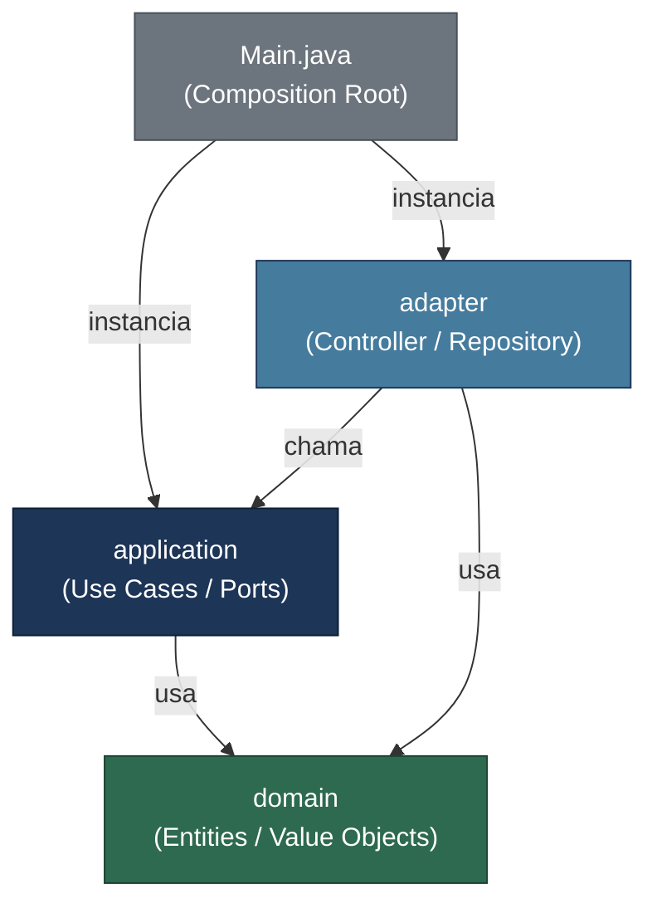
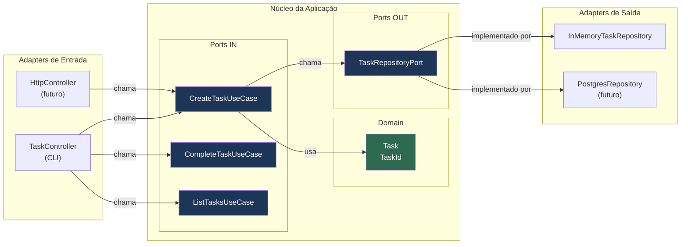
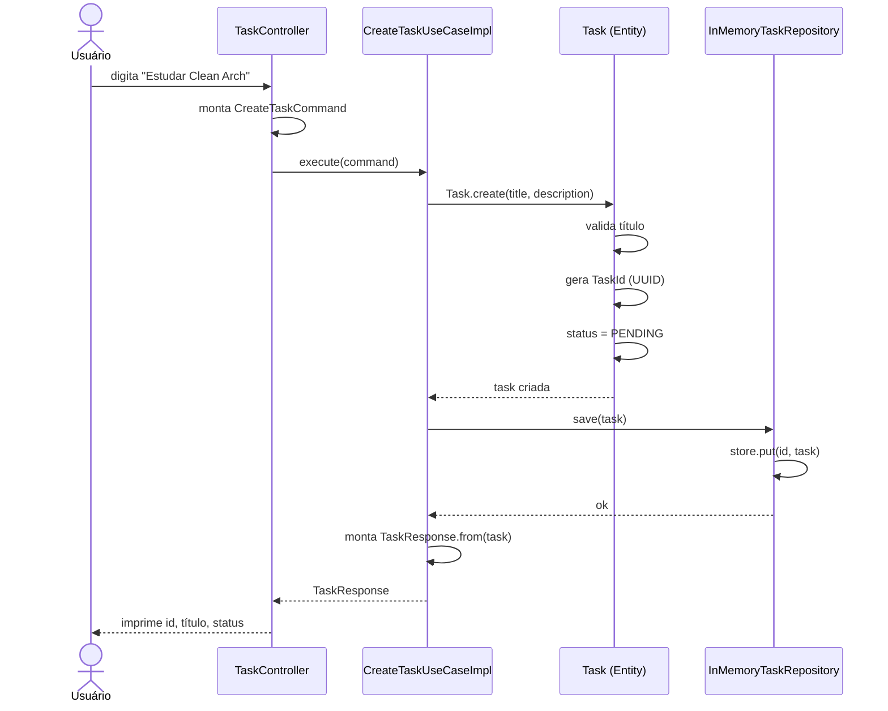
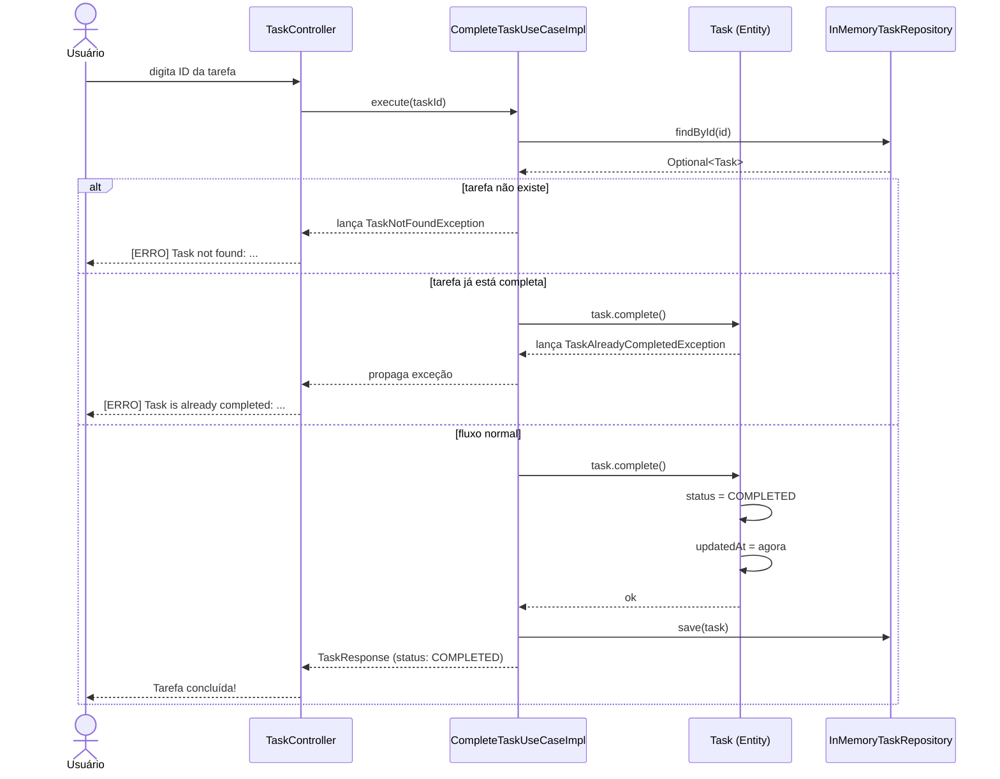
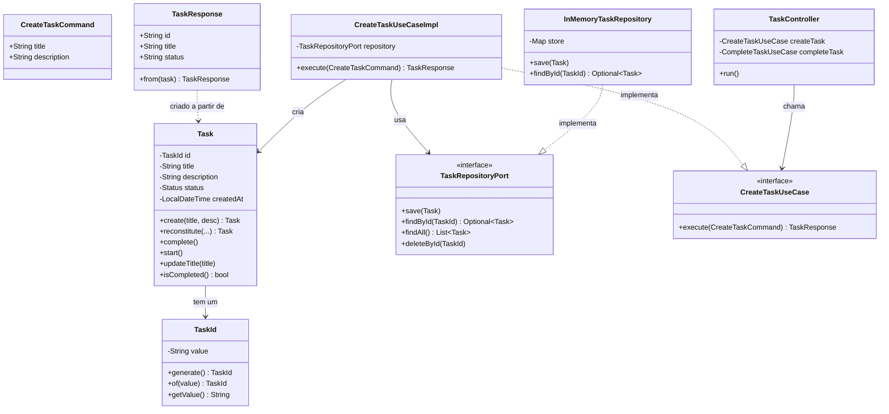
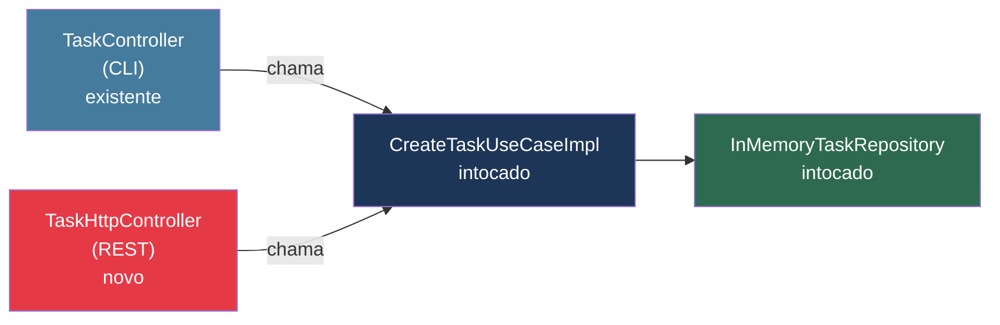

# Clean Architecture em Java Puro

> Projeto didático de gerenciamento de tarefas construído com **Java 21 puro**, sem frameworks,
> para demonstrar na prática os conceitos da **Arquitetura Limpa** de Robert C. Martin (Uncle Bob).

---

## Índice

1. [O problema que a Clean Architecture resolve](#1-o-problema-que-a-clean-architecture-resolve)
2. [A ideia central: a Regra da Dependência](#2-a-ideia-central-a-regra-da-dependência)
3. [As 4 Camadas](#3-as-4-camadas)
4. [Ports & Adapters — o coração do padrão](#4-ports--adapters--o-coração-do-padrão)
5. [O fluxo completo de uma operação](#5-o-fluxo-completo-de-uma-operação)
6. [Estrutura de arquivos comentada](#6-estrutura-de-arquivos-comentada)
7. [O papel de cada classe](#7-o-papel-de-cada-classe)
8. [Por que DTOs? Command e Response](#8-por-que-dtos-command-e-response)
9. [O poder da substituição](#9-o-poder-da-substituição)
10. [Como executar](#10-como-executar)
11. [Resumo visual rápido](#11-resumo-visual-rápido)
12. [Leituras recomendadas](#12-leituras-recomendadas)

---

## 1. O problema que a Clean Architecture resolve

Sem uma arquitetura definida, sistemas crescem assim:

```
┌──────────────────────────────────────────────────────────┐
│                      Código típico                        │
│                                                          │
│   Controller ──────► Service ──────► Repository          │
│       │                  │                │              │
│       │            lógica de         SQL direto          │
│       │            negócio +         no service          │
│       │            validação +                           │
│       │            formatação                            │
│       │            misturadas                            │
│       │                                                  │
│       └──────────────────────────────────────────────────│
│                tudo acoplado a tudo                       │
└──────────────────────────────────────────────────────────┘
```

**Os sintomas:**

- Trocar o banco de dados exige mexer no service (e às vezes no controller)
- Testar a lógica de negócio exige subir o banco inteiro
- Adicionar um novo canal (ex: REST + GraphQL) duplica código
- Quanto maior o sistema, mais difícil entender o que ele faz de negócio

**A Clean Architecture separa claramente:**

| O que o sistema **é** | O que o sistema **usa** |
|---|---|
| Regras de negócio (domínio) | Banco de dados |
| O que o sistema faz (casos de uso) | Framework web |
| — | CLI, fila de mensagens, etc. |

> O que o sistema **é** fica no centro. O que ele **usa** fica na borda e pode ser trocado.

---

## 2. A ideia central: a Regra da Dependência

```
         ╔═══════════════════════════════════════════╗
         ║                                           ║
         ║    ╔═══════════════════════════════╗      ║
         ║    ║                               ║      ║
         ║    ║    ╔═══════════════════╗      ║      ║
         ║    ║    ║                   ║      ║      ║
         ║    ║    ║    ╔═════════╗    ║      ║      ║
         ║    ║    ║    ║ DOMAIN  ║    ║      ║      ║
         ║    ║    ║    ╚═════════╝    ║      ║      ║
         ║    ║    ║   APPLICATION     ║      ║      ║
         ║    ║    ╚═══════════════════╝      ║      ║
         ║    ║        ADAPTERS               ║      ║
         ║    ╚═══════════════════════════════╝      ║
         ║          FRAMEWORKS & DRIVERS             ║
         ╚═══════════════════════════════════════════╝

              ◄─────────────────────────────
              as dependências só apontam para DENTRO
```

**A regra de ouro:**

- `domain` não importa nada de nenhuma outra camada
- `application` importa apenas `domain`
- `adapter` importa `application` e `domain`
- `Main.java` importa tudo (é o único ponto de montagem)



---

## 3. As 4 Camadas

### Camada 1 — Domain (Domínio)

```
┌─────────────────────────────────────────────────────────┐
│                        DOMAIN                           │
│                                                         │
│  ┌──────────────────────┐   ┌──────────────────────┐   │
│  │     Task (Entity)    │   │   TaskId (ValueObj)  │   │
│  │                      │   │                      │   │
│  │  - id: TaskId        │   │  - value: String     │   │
│  │  - title: String     │   │                      │   │
│  │  - status: Status    │   │  + generate(): TaskId│   │
│  │  - createdAt         │   │  + of(str): TaskId   │   │
│  │                      │   └──────────────────────┘   │
│  │  + create()          │                              │
│  │  + complete()   ◄────┼── regras de negócio aqui     │
│  │  + start()           │                              │
│  │  + updateTitle()     │                              │
│  └──────────────────────┘                              │
│                                                         │
│  Sem imports externos. Nem java.sql, nem annotations.   │
└─────────────────────────────────────────────────────────┘
```

**O que vive aqui:** entidades, value objects, exceções de domínio e regras que existiriam mesmo sem computador (ex: "uma tarefa concluída não pode ser concluída novamente").

**O que NÃO vive aqui:** nada de banco, framework, HTTP, JSON.

---

### Camada 2 — Application (Casos de Uso)

```
┌─────────────────────────────────────────────────────────────┐
│                       APPLICATION                           │
│                                                             │
│   PORTAS DE ENTRADA          PORTAS DE SAÍDA                │
│   (o que o sistema FAZ)      (o que o sistema PRECISA)      │
│                                                             │
│  ┌─────────────────────┐    ┌──────────────────────────┐   │
│  │  <<interface>>      │    │  <<interface>>           │   │
│  │  CreateTaskUseCase  │    │  TaskRepositoryPort      │   │
│  │  GetTaskUseCase     │    │                          │   │
│  │  ListTasksUseCase   │    │  + save(Task)            │   │
│  │  CompleteTaskUseCase│    │  + findById(TaskId)      │   │
│  │  DeleteTaskUseCase  │    │  + findAll()             │   │
│  └─────────────────────┘    │  + deleteById(TaskId)   │   │
│                              └──────────────────────────┘   │
│   IMPLEMENTAÇÕES                                            │
│  ┌──────────────────────────────────────────────────────┐   │
│  │  CreateTaskUseCaseImpl  →  cria Task + salva no repo │   │
│  │  CompleteTaskUseCaseImpl → busca + chama task.complete│  │
│  │  ...                                                 │   │
│  └──────────────────────────────────────────────────────┘   │
│                                                             │
│   Conhece: domain. Desconhece: banco, HTTP, CLI.            │
└─────────────────────────────────────────────────────────────┘
```

---

### Camada 3 — Adapters (Adaptadores)

```
┌─────────────────────────────────────────────────────────────┐
│                        ADAPTERS                             │
│                                                             │
│  ADAPTER DE ENTRADA              ADAPTER DE SAÍDA           │
│  (quem chama o sistema)          (quem o sistema chama)     │
│                                                             │
│  ┌──────────────────────┐   ┌───────────────────────────┐  │
│  │   TaskController     │   │  InMemoryTaskRepository   │  │
│  │                      │   │                           │  │
│  │  Lê input do         │   │  Implementa               │  │
│  │  terminal →          │   │  TaskRepositoryPort       │  │
│  │  chama UseCase →     │   │  usando um Map<>          │  │
│  │  imprime resultado   │   │                           │  │
│  └──────────────────────┘   └───────────────────────────┘  │
│                                                             │
│  Poderia ser substituído por:   Poderia ser substituído por:│
│  • HttpController (REST)        • JdbcTaskRepository        │
│  • GrpcController               • MongoTaskRepository       │
│  • QueueConsumer                • RedisTaskRepository       │
└─────────────────────────────────────────────────────────────┘
```

---

### Camada 4 — Main (Composition Root)

```
┌─────────────────────────────────────────────────────────────┐
│                        Main.java                            │
│                   (Composition Root)                        │
│                                                             │
│   1. new InMemoryTaskRepository()   ← cria infraestrutura  │
│              │                                              │
│              ▼                                              │
│   2. new CreateTaskUseCaseImpl(repo) ← injeta no use case  │
│              │                                              │
│              ▼                                              │
│   3. new TaskController(useCase...) ← injeta no controller │
│              │                                              │
│              ▼                                              │
│   4. controller.run()               ← liga o sistema       │
│                                                             │
│   É o único arquivo que conhece TODAS as implementações.   │
│   Com Spring Boot, o container de DI faz isso por você.    │
└─────────────────────────────────────────────────────────────┘
```

---

## 4. Ports & Adapters — o coração do padrão

A metáfora é a de um hexágono (por isso também chamada de **Arquitetura Hexagonal**): o sistema tem "portas" para se comunicar com o mundo externo, e "adapters" que encaixam nessas portas.

```
                    ┌─────────────────────┐
    CLI ────────────►                     ◄──────── In-Memory DB
                    │                     │
    REST API ───────►     USE CASES       ◄──────── PostgreSQL
  (futuro)         │                     │          (futuro)
                    │     + DOMAIN        ◄──────── MongoDB
    gRPC ───────────►                     │          (futuro)
   (futuro)         │                     │
                    └─────────────────────┘
         adapters           núcleo           adapters
         de entrada      (imutável)          de saída
```



---

## 5. O fluxo completo de uma operação

Veja o caminho percorrido desde o usuário digitar no terminal até a tarefa ser salva e a resposta retornar.

### Diagrama de Sequência — "Criar Tarefa"



---

### Diagrama de Sequência — "Completar Tarefa"



---

## 6. Estrutura de arquivos comentada

```
clean-architecture-java/
│
├── pom.xml                              ← build Maven (Java 21, sem dependências!)
│
└── src/main/java/com/example/
    │
    ├── domain/                          ← CAMADA 1: regras de negócio puras
    │   │
    │   ├── entity/
    │   │   └── Task.java                ← entidade principal
    │   │                                   comportamentos: create, complete, start
    │   │
    │   ├── valueobject/
    │   │   └── TaskId.java              ← ID imutável (UUID encapsulado)
    │   │                                   não é um String — tem significado de negócio
    │   │
    │   └── exception/
    │       ├── TaskNotFoundException.java
    │       └── TaskAlreadyCompletedException.java
    │
    ├── application/                     ← CAMADA 2: casos de uso
    │   │
    │   ├── port/
    │   │   ├── in/                      ← portas de ENTRADA
    │   │   │   ├── CreateTaskUseCase.java      ← interface
    │   │   │   ├── GetTaskUseCase.java         ← interface
    │   │   │   ├── ListTasksUseCase.java       ← interface
    │   │   │   ├── CompleteTaskUseCase.java    ← interface
    │   │   │   └── DeleteTaskUseCase.java      ← interface
    │   │   │
    │   │   └── out/                     ← portas de SAÍDA
    │   │       └── TaskRepositoryPort.java     ← interface
    │   │
    │   ├── dto/
    │   │   ├── CreateTaskCommand.java   ← dado de entrada (imutável, record)
    │   │   └── TaskResponse.java        ← dado de saída (imutável, record)
    │   │
    │   └── usecase/                     ← implementações dos casos de uso
    │       ├── CreateTaskUseCaseImpl.java
    │       ├── GetTaskUseCaseImpl.java
    │       ├── ListTasksUseCaseImpl.java
    │       ├── CompleteTaskUseCaseImpl.java
    │       └── DeleteTaskUseCaseImpl.java
    │
    ├── adapter/                         ← CAMADA 3: adaptadores
    │   │
    │   ├── controller/
    │   │   └── TaskController.java      ← adapter de ENTRADA: lê do terminal
    │   │
    │   └── repository/
    │       └── InMemoryTaskRepository.java  ← adapter de SAÍDA: guarda em Map<>
    │
    └── Main.java                        ← CAMADA 4: Composition Root
                                            único ponto que instancia e conecta tudo
```

---

## 7. O papel de cada classe



---

## 8. Por que DTOs? Command e Response

Um erro comum é passar a entidade de domínio direto entre as camadas. Veja o problema:

```
❌ SEM DTOs — vazamento de domínio

  Controller                UseCase               Repository
      │                        │                       │
      │──── Task task ─────────►                       │
      │     (entidade exposta                          │
      │      para fora do domínio)                     │
      │                        │──── Task task ────────►
      │◄─── Task task ──────────                       │
      │     (detalhes internos                         │
      │      do domínio expostos)                      │
```

```
✅ COM DTOs — fronteiras claras

  Controller                UseCase               Repository
      │                        │                       │
      │── CreateTaskCommand ───►                       │
      │   (só o necessário,     │──── Task task ────────►
      │    sem lógica interna)  │     (domínio fica     │
      │                        │      dentro)          │
      │◄── TaskResponse ────────                       │
      │    (só o necessário                            │
      │     para exibir)                               │
```

**Benefícios concretos:**

| Situação | Sem DTO | Com DTO |
|---|---|---|
| Adicionar campo interno na Task | Quebra a API do controller | Controller não precisa mudar |
| Expor versões diferentes da API | Impossível sem duplicar | `TaskResponseV2` sem tocar no domínio |
| Validar entrada do usuário | Lógica misturada na entidade | Validação centralizada no Command |
| Serializar para JSON | Anotações Jackson na entidade | Anotações só no DTO (domínio limpo) |

---

## 9. O poder da substituição

### Trocar o banco de dados

```
ANTES (in-memory):
┌─────────────┐      ┌──────────────────────┐      ┌───────────────────────────┐
│ UseCase     │─────►│ TaskRepositoryPort   │◄─────│ InMemoryTaskRepository    │
│ (intocado)  │      │ (interface intocada) │      │ Map<String, Task> store   │
└─────────────┘      └──────────────────────┘      └───────────────────────────┘

DEPOIS (PostgreSQL):
┌─────────────┐      ┌──────────────────────┐      ┌───────────────────────────┐
│ UseCase     │─────►│ TaskRepositoryPort   │◄─────│ PostgresTaskRepository    │
│ (intocado)  │      │ (interface intocada) │      │ JDBC + SQL                │
└─────────────┘      └──────────────────────┘      └───────────────────────────┘

Apenas 2 passos:
  1. Cria PostgresTaskRepository implements TaskRepositoryPort
  2. Altera Main.java: new PostgresTaskRepository(dataSource)

Domínio: 0 linhas alteradas
Casos de uso: 0 linhas alteradas
Controller: 0 linhas alteradas
```

---

### Adicionar uma API REST

```
ANTES (só CLI):

  [ TaskController (CLI) ] ──► [ CreateTaskUseCase ] ──► [ Repository ]

DEPOIS (CLI + REST em paralelo):

  [ TaskController (CLI)  ] ──►
                                [ CreateTaskUseCase ] ──► [ Repository ]
  [ TaskHttpController    ] ──►
    (novo arquivo apenas)
```



---

### Comparação geral

| Situação | Sem arquitetura | Com Clean Architecture |
|---|---|---|
| Trocar banco de dados | Mexe em várias classes | Cria 1 classe, altera só `Main.java` |
| Adicionar API REST | Refatora lógica espalhada | Cria 1 novo adapter de entrada |
| Testar regra de negócio | Precisa de banco e framework | Testa `Task.java` com JUnit puro |
| Ler o que o sistema faz | Rastreia código técnico misturado | Lê as interfaces em `port/in` |
| Onboarding de novo dev | Dependências circulares | Camadas guiam a leitura |
| Adicionar validação | Espalhada em várias camadas | Centralizada nos Commands |

---

## 10. Como executar

### Pré-requisitos
- Java 21+
- Maven 3.8+

### Passo a passo

```bash
# 1. Entrar no diretório
cd clean-architecture-java

# 2. Compilar
mvn compile

# 3. Gerar o JAR executável
mvn package

# 4. Rodar
java -jar target/task-manager.jar
```

### O que esperar

```text
=== Gerenciador de Tarefas (Clean Architecture) ===

----------------------------
1. Criar tarefa
2. Listar tarefas
3. Buscar tarefa por ID
4. Completar tarefa
5. Deletar tarefa
0. Sair
Opcao: 1

Titulo: Estudar Clean Architecture
Descricao: Ler o livro do Uncle Bob

Tarefa criada com sucesso!

  ID:        a1b2c3d4-...
  Titulo:    Estudar Clean Architecture
  Descricao: Ler o livro do Uncle Bob
  Status:    PENDING
  Criado em: 2026-05-25T...
```

---

## 11. Resumo visual rápido

```text
┌─────────────────────────────────────────────────────────────────────────────────┐
│                                                                                 │
│   CAMADA         RESPONSABILIDADE           CONHECE          NÃO CONHECE       │
│   ──────────────────────────────────────────────────────────────────────────   │
│   domain         Regras de negócio puras    —                tudo externo       │
│   application    Orquestra o domínio        domain           banco, HTTP, CLI  │
│   adapter        Traduz entrada/saída       app + domain     outros adapters   │
│   main           Monta as dependências      tudo             —                 │
│                                                                                 │
│   CONCEITO       ONDE APARECE              PARA QUE SERVE                      │
│   ──────────────────────────────────────────────────────────────────────────   │
│   Entity         domain/entity             Encapsula estado e comportamento    │
│   Value Object   domain/valueobject        Identidade por valor, imutável      │
│   Use Case       application/usecase       Um caso de uso = uma ação do sistema│
│   Port IN        application/port/in       Contrato do que o sistema oferece   │
│   Port OUT       application/port/out      Contrato do que o sistema precisa   │
│   Adapter IN     adapter/controller        Traduz mundo externo → use case     │
│   Adapter OUT    adapter/repository        Traduz use case → infraestrutura    │
│   Command DTO    application/dto           Dados de entrada validados          │
│   Response DTO   application/dto           Dados de saída sem expor o domínio  │
│   Comp. Root     Main.java                 Único ponto de montagem de deps.    │
│                                                                                 │
└─────────────────────────────────────────────────────────────────────────────────┘
```

---

## 12. Leituras recomendadas

| Recurso | Por que ler |
| --- | --- |
| **Clean Architecture** — Robert C. Martin | O livro original. Capítulos 15–22 são os mais relevantes |
| **Hexagonal Architecture** — Alistair Cockburn | O artigo original do padrão Ports & Adapters |
| **Domain-Driven Design** — Eric Evans | Aprofunda entidades, value objects e agregados |
| **Implementing DDD** — Vaughn Vernon | Versão mais prática do DDD com exemplos em Java |
| **Architecture Patterns with Python** — Percival & Gregory | Excelente para entender ports & adapters na prática |
